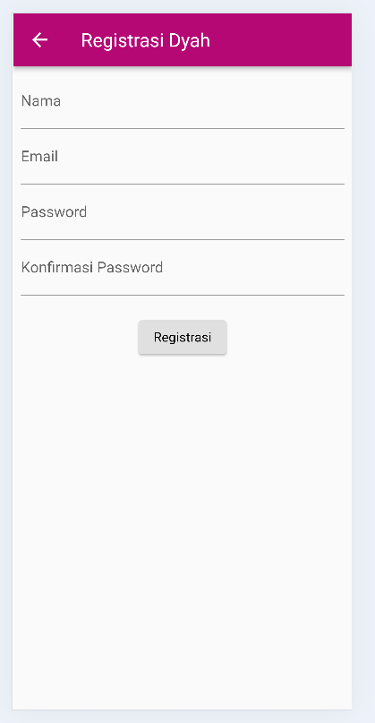
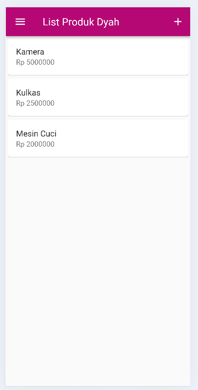
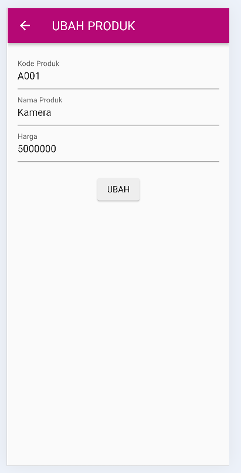
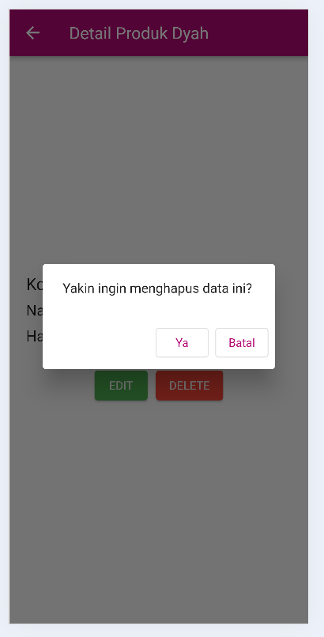
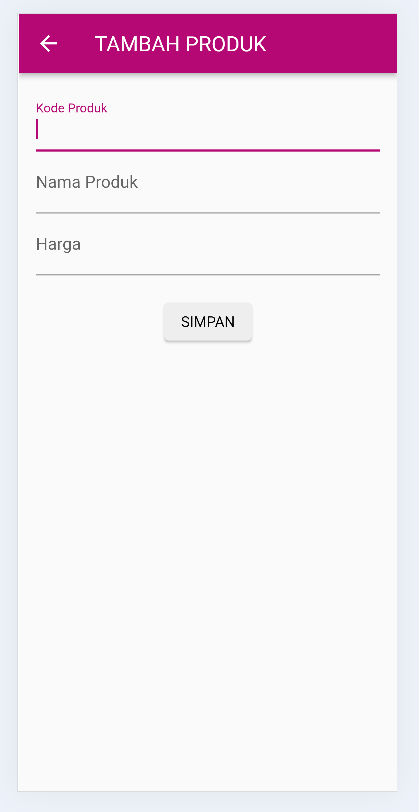
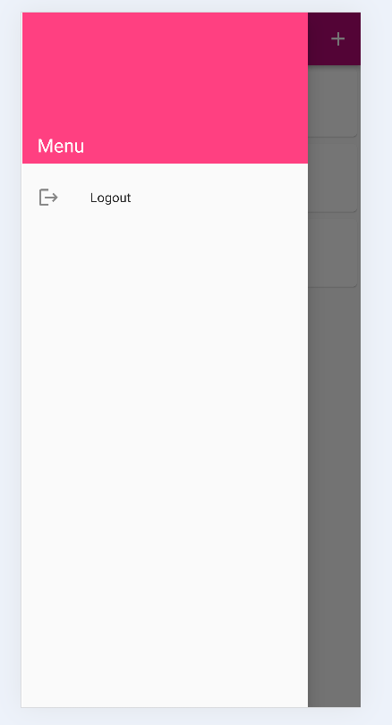

# Tugas 8 - Pertemuan 10 (Toko Kita)

## Identitas
**Nama:** Dyah Ghaniya Putri  
**NIM:** H1D023022   
**Shift Awal:** A  
**Shift Baru:** F

---

## Tentang Aplikasi
Aplikasi mobile sederhana untuk mengelola daftar produk. Fitur utama meliputi login, registrasi, daftar produk, tambah produk, ubah produk, hapus produk, detail produk, dan logout. Proyek ini dibuat menggunakan Flutter tanpa backend (data masih statis di dalam aplikasi).  

---

## Fitur Aplikasi
- Halaman Login memvalidasi email dan password sebelum masuk aplikasi.
- Halaman Registrasi membuat data akun secara lokal tanpa backend.
- List Produk menampilkan tiga produk contoh dalam ListView.
- Detail Produk menampilkan kode, nama, dan harga produk.
- Tombol Edit membuka form dengan data yang sudah terisi.
- Tombol Delete memunculkan dialog konfirmasi penghapusan.
- Form Produk menyimpan atau mengubah produk berdasarkan mode tambah/ubah.
- Drawer menyediakan tombol Logout untuk kembali ke LoginPage.

---

### Penjelasan Kode (Halaman)
- **LoginPage**: TextFormField, FormState.validate(), dan Navigator.pushReplacement() untuk memvalidasi input email & password, lalu berpindah ke halaman ProdukPage jika valid.
- **RegistrasiPage**: validator pada nama, email, password, dan konfirmasi password memastikan semua input benar sebelum registrasi dianggap berhasil (masih lokal, belum tersimpan).
- **ProdukPage**: ListView berisi tiga objek Produk, tombol tambah memakai Navigator.push(), Drawer untuk logout yang akan menampilkan daftar produk dan menyediakan navigasi ke tambah produk serta logout.
- **ItemProduk**: GestureDetector yang melakukan Navigator.push() ke ProdukDetail() yang setiap card produknya bisa diklik untuk membuka halaman detail.
- **ProdukDetail**: menampilkan data produk dan dua tombol yakni Edit untuk membuka ProdukForm dengan data terisi dan Delete untuk memunculkan dialog konfirmasi menggunakan showDialog.
- **ProdukForm**: pengecekan widget.produk != null untuk menentukan mode tambah/ubah untuk menampilkan form yang bisa menambah atau mengubah data produk.

---

### Hasil Aplikasi

- **Halaman Login**
![Screenshot]
(login-tokokita.png)

- **Halaman Register**

- **Halaman Daftar Produk**

- **Halaman Detail Produk**

- **Halaman Edit**

- **Halaman Konfirmasi Delete**

- **Halaman Form Produk**

- **Halaman Drawer (Logout)**

---
